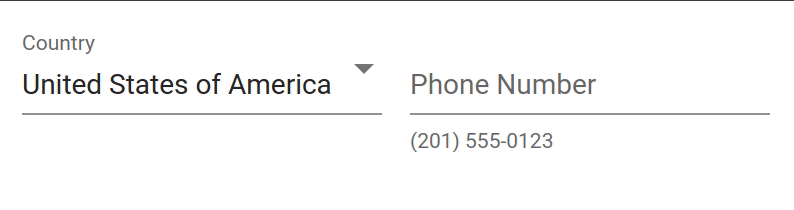

# Angular Material Phone

This repository contains a simply Angular 9 project that illustrates a way of handling phone number input using Angular Material design components and the [awesome-phonenumber](https://github.com/grantila/awesome-phonenumber) library which is a pre-compiled version of Google's [libphonenumber](https://github.com/google/libphonenumber).

A detailed discussion of this project's contents can be found in my blog post [Angular Material Phone Entry](https://mikedalrymple.com/angular-material-phone).

The end result looks something like this:



# Running

Building and running the application follows standard Angular patterns.

```bash
npm install
npm start
```

Once the server is running the application will be available at [http://localhost:4200](http://localhost:4200).

# Testing with Jest

The project uses Jest for unit testing rather than the standard Karma/Jasmine found in most Angular projects.  I don't think I could manage developing in Angular without using Jest. I'd like to say thanks to the teams behind the following projects that make testing Typescript/Angular projects feasible with Jest.

* [@angular-builders/jest](https://github.com/just-jeb/angular-builders/tree/master/packages/jest)
* [jest-preset-angular](https://github.com/thymikee/jest-preset-angular)
* [ts-jest](https://kulshekhar.github.io/ts-jest/)

See how great it is for yourself by running this project's tests yourself:
```bash
npm run test
```
